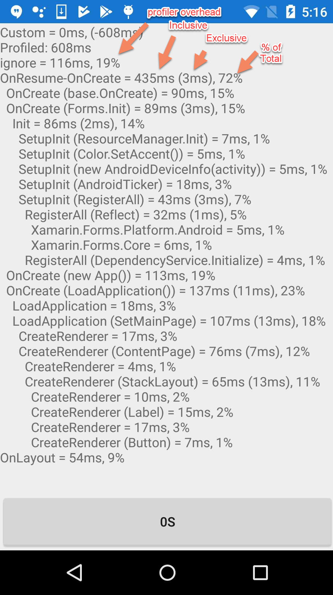

# Android Startup Performance
Xamarin management has identified Android startup performance as our top issue. 

# Goal
What, exactly constitutes "Startup performance"? It could mean different things to different people. For example, [this customer][1] blogs about (1) time to launch a minimal app (e.g. "Hello World") and (2) an app with a bit of XAML. The first would target mono/android stack while the latter would target XAML performance. Both could be targeted, but which first? 

To fix the right issue, the top issue, and to properly measure our progress we need to know the specific feedback management is looking at. Bugs? Twitter? Blog posts? Sales and support? Telemetry? 

Is this the top priority? And if so, which scenario, exactly, are we optimizing? This is step 0.
# Blog
_February_ 

Added `Xamarin.Forms.Profile` which allows self profiling of startup. The class is public but browser hidden. Like a profiler, it allows collection of a tree of timings. Instrumentation starts with a call to `Profile.Push("description")` and ends with a call to `Profile.Pop()`. The logic between those calls can be partitioned by calling `Profile.PushPop("description")`. Instrumentation ends with a call to `Profile.Stop()` at which point the stack is unwound and those frames discarded. The data is accessible via `Profile.Data`. 

It's interesting to note that simply allocating the memory for `Profiler` takes 20% of the total profiled time. I'm guessing this has to do with allocation.  After initialization the profile allocates no memory so long as less than 1k samples are taken. Regardless, the profiler clearly cannot be enabled in release. Instead, all the `Profile` calls return `void` so they can be attributed `Conditional` and enabled via the define `PROFILE`. 

The result looks like this:

The above is a profile of `XFMinUp` which is the template Xamarin Forms application, without XAML, with FastRenderers enabled. The first thing to go after is `OnCreate (Forms.Init)` and see how many of our initialization bits can be deferred or made early bound. For example, the `AndroidTicker` may not need to be initialized so early. And `RegisterAll` can be made early bound. 

_January_

Just to get going, let's assume we're minimizing hot launch times of our template projects. That's the default experience we expose so we should track it regardless. We should also compare it against our competitors default startup times.

Our scenarios are: 
* The Xamarin Forms Android template project
* The Xamarin Android template project
* A native Java Android project

[This customer][1] simply used `Java.Lang.JavaSystem.CurrentTimeMillis()` to time the difference between `onCreate` and `onResume`. That was enough to kick off this project, so we might as well start there! Because that will not capture the entire startup stack we, just for fun, took slow motion video capture of [Android Studio][ASStartUp], [Xamarin.Android][XAStartUp], [Xamarin.Android +AOT][XAAotUp], [Xamarin.Forms][XFStartUp], and [Xamarin.Forms +AOT][XFAotUp] starting up. And all [side by side][StartUp]. With those numbers we can compare:
* WC: Wall Clock
* App: `onResume` - `onCreate`, application inc XF
* Mono/XA: WC - C#, roughly mono + XA

|Plat|WC|%|App|%|Mono+XA|%
|---:|---:|---:|---:|---:|---:|---:|
|AS|500ms||158ms|31%|
|XA+AOT|750ms| |109ms| 14%|641ms| 85%|
|XA|1200ms| |113ms| 10%|1087ms| 90%|
|XF+AOT|1200ms| |417ms|34%|780ms| 65%|
|XF|2150ms| |875ms| 40%|1275ms| 60%|
|XF vs XA|+950ms| +80%|+762ms| |+188| -20%|

So, 
* XF template takes almost very roughly %80 longer to load than a XA template project. So next well try and strip a XF project down (remove XAML for starters) and see how close we can get to XA.
* AOT helps a ton but is still marked experimental and only available in VS Enterprise. Mgmt is discussing. 

After we get crawling, Marek Habersack of the Android team has suggested using [SimplePerf][SimplePerf] profiler. 

# Stack and Scenarios
Xamarin startup time can be roughly broken down into the following layers which can be roughly measured with the following apps.
|Layer|App|
|---|---|
|XAML|XF Template|
|XF|XF Template w/o XAML|
|XA|XA Template|
|Mono|"Hello World" Console App|

A Android Studio "Hello World" app can provide a baseline.

# Build Considerations
A list of the build switches that affect performance.
* `release`: Use release builds
* `linker`: Use full linking
* `XAML compiler`: Precompile the XAML
* `AOT`: Has a large impact on startup performance. Right now, it's only available to VS Ent customers. It's also marked experimental. 

# Resources
* [Prepare For Release][ReleasePrep]: Our docs on what to do before shipping. 
* [SimplePerf][SimplePerf]: A tool which can help measuring native performance with very little overhead.
* [Adam Pedley][Pedley]: Nice blog post of template startup times with various build options.

[1]: https://programistologia.pl/2019/01/03/en-what-bothers-xamarin-developers-part-3/
[SimplePerf]: https://android.googlesource.com/platform/system/extras/+/master/simpleperf/doc/README.md
[XAStartUp]: https://m.youtube.com/watch?v=G9ylTGtsy5s
[XAAotUp]: https://m.youtube.com/watch?v=3RLjpKAUVn4
[XFStartUp]: https://www.youtube.com/watch?v=cKz8KDs1NAA
[XFAotUp]: https://m.youtube.com/watch?v=lVG-CEt78L0
[ASStartUp]: https://m.youtube.com/watch?v=meGBmexhtPo
[StartUp]: https://youtu.be/fyv2rIV6K1s
[Pedley]: https://xamarinhelp.com/improving-xamarin-forms-startup-performance/

[ReleasePrep]: https://docs.microsoft.com/en-us/xamarin/android/deploy-test/release-prep/?tabs=windows#AOT_Compilation